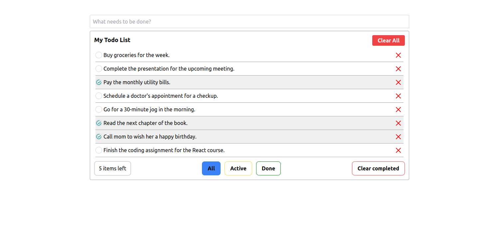

# To-Do App

This is a simple To-Do app built using Vite, a fast development tool for front-end projects. This app allows you to create, manage, and organize your tasks efficiently.



## Features

- 🚀 Fast development with Vite's HMR (Hot Module Replacement).
- 💡 Modern JavaScript (ES6+).
- 📝 Create, manage, and delete tasks.
- ✅ Mark tasks as complete.
- 🧩 Simple and clean user interface.

## Getting Started

To get started with this To-Do app, follow these steps:

1. Clone the repository:

   ```sh
   git clone https://github.com/masoudomidvar/to-do-app.git && cd to-do-app
   ```

2. Install the dependencies.
   ```sh
   npm install
   ```

3. Run the project.
   ```sh
   npm run dev
   ```


## Dependencies
- Vite: The build tool used for fast development.
- React.js: The JavaScript framework used to build the user interface.
- Tailwind: Rapidly build modern websites without ever leaving your HTML.
- Redux toolkit: The official, opinionated, batteries-included toolset for efficient Redux development
